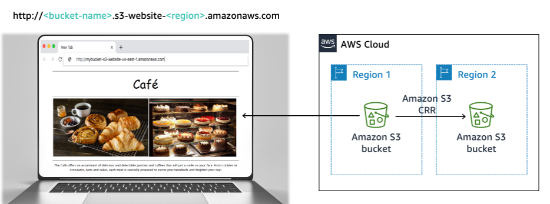

# Hosting a Static Website on Amazon S3

This guide walks through the process of deploying a static website using Amazon S3 (Simple Storage Service).



## What is Amazon S3?

Amazon S3 (Simple Storage Service) is an object storage service that offers industry-leading scalability, data availability, security, and performance. One of its features allows hosting static websites without the need for web servers.

## Prerequisites

- AWS account
- Basic knowledge of HTML, CSS, and JavaScript
- Website files ready to upload (HTML, CSS, JavaScript, images, etc.)

## Steps to Host a Static Website on Amazon S3

### 1. Create an S3 Bucket

- Go to the AWS Management Console
- Navigate to the S3 service
- Click "Create bucket"
- Enter a unique bucket name (e.g., `mycafe-website`)
- Choose a region (e.g., `us-east-1`)
- Uncheck "Block all public access" (since we want the website to be publicly accessible)
- Click "Create bucket"

### 2. Upload Website Files

- Select your newly created bucket
- Click "Upload"
- Add your website files (index.html, CSS, JavaScript, images, etc.)
- Ensure `index.html` is included as this will be your main page
- Click "Upload"

### 3. Enable Static Website Hosting

- Go to the Properties tab of your S3 bucket
- Scroll down to "Static website hosting"
- Click "Edit"
- Select "Enable"
- Set:
  - Index document: `index.html`
  - (Optional) Error document: `error.html`
- Click "Save changes"

### 4. Set Permissions to Make Content Public

- Go to the Permissions tab of your bucket
- Under Bucket Policy, click "Edit"
- Add the following bucket policy (replace `mycafe-website` with your actual bucket name):

```json
{
  "Version": "2012-10-17",
  "Statement": [
    {
      "Sid": "PublicRead",
      "Effect": "Allow",
      "Principal": "*",
      "Action": "s3:GetObject",
      "Resource": "arn:aws:s3:::mycafe-website/*"
    }
  ]
}
```

- Click "Save changes"

### 5. Access Your Website

- Go back to the Properties tab
- Scroll down to "Static website hosting"
- Find your S3 website endpoint, which should look like:
  ```
  http://mycafe-website.s3-website-us-east-1.amazonaws.com
  ```
- Open this URL in a web browser to access your website

## Benefits of S3 Website Hosting

- Low cost
- Highly scalable and reliable
- No server management required
- Integrates well with other AWS services
- Can be used with Amazon CloudFront for global content delivery

## Additional Considerations

- For custom domain names, you can use Amazon Route 53
- For HTTPS, use Amazon CloudFront with your S3 bucket
- Set up versioning for your bucket to maintain previous versions of your files
- Consider implementing logging to track access to your website

## Cleaning Up

To avoid incurring charges:
1. Delete all objects in the bucket
2. Delete the bucket itself
3. Remove any associated DNS records if you set up a custom domain

## Workshop Files

You can find the sample static website files for this exercise in the `static-website/` directory.

## AWS CLI Implementation

For an automated deployment using AWS CLI, check out the `aws_cli/` directory which contains:

- `setup.sh`: Script to create S3 bucket and deploy the static website
- `test.sh`: Script to verify the deployed website is accessible
- `cleanup.sh`: Script to remove all created resources
- `README.md`: Detailed instructions on using these scripts

To deploy using AWS CLI:

```bash
cd aws_cli
chmod +x *.sh
./setup.sh
```

This approach is ideal for automation and CI/CD pipelines.