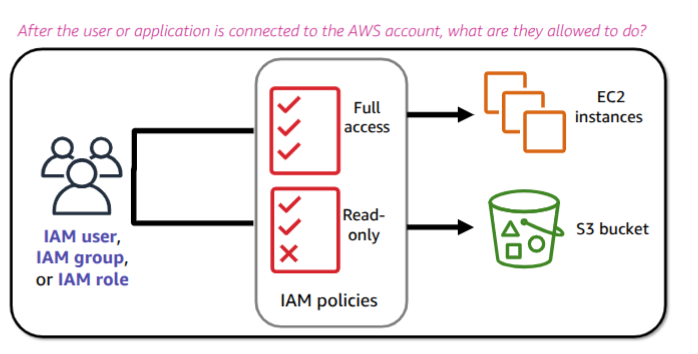
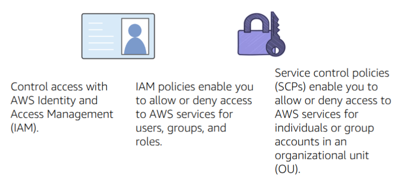

# Part 4) AWS Cloud Security

> **Security is the highest priority at Amazon Web Services (AWS**). AWS delivers a scalable cloud computing environment that is designed for high **availability** and **dependability**, while providing the tools that enable you to run a wide range of applications. Helping to protect the **confidentiality**, **integrity**, and **availability** of your systems and **data is critical to AWS**, and so is maintaining customer trust and confidence.
> 

In this part, we will cover the following topics:

- Recognize the shared responsibility model
- Identify the responsibility of the customer and AWS
- Recognize IAM users, groups, and roles
- Describe different types of security credentials in IAM
- Identify the steps to securing a new AWS account
- Explore IAM users and groups
- Recognize how to secure AWS data

# Topics
1. [AWS shared responsibility model](#aws-shared-responsibility-model)
2. [AWS Identity and Access Management (IAM)](#aws-identity-and-access-management-iam)
3. [Securing a new AWS account](#securing-a-new-aws-account)
4. [Securing accounts](#securing-accounts)
5. [Securing data on AWS](#securing-data-on-aws)

---

# AWS shared responsibility model


Security and compliance are a **shared responsibility between AWS and the customer**. This shared responsibility model is designed to help relieve the customer's operational burden. At the same time, to provide the flexibility and customer control that enables the deployment of customer solutions on AWS, **the customer remains responsible for some aspects of the overall security**. The differentiation of who is responsible for what is commonly referred to as 

**`security "of" The cloud versus security "in" The cloud`.**

**AWS** **operates**, **manages**, and **controls** the components from the **software virtualization layer** down to the **physical security of the facilities** where AWS services operate.**AWS is responsible for protecting the infrastructure that runs all the services that are offered in the AWS Cloud.** This infrastructure is composed of the ***hardware***, ***software***, ***networking***, ***and facilities that run the AWS Cloud services.***

**The customer is responsible for** **the encryption of data at rest and data in transit**. The 

customer should also ensure that the **network is configured for security and that security** 

**credentials and logins are managed safely**. Additionally, the customer is responsible for the 

**configuration of security groups and the configuration of the operating system (guest os)** 

that runs on compute instances that they launch (**including updates and security patches**).

## AWS responsibility: Security **of** the cloud

AWS is responsible for protecting the **global infrastructure that runs all the services** that are offered in the AWS Cloud. The global infrastructure includes AWS Regions, Availability Zones, and edge locations. 

AWS is responsible for the physical infrastructure that hosts your resources, including

- **Physical security of data centers**
  
  with controlled, need-based access; located in nondescript facilities, with 24/7 security guards; two-factor authentication; access logging and review; video surveillance; and disk degaussing and destruction
  
- **Hardware infrastructure**
  
  such as servers, storage devices, and other appliances that AWS relies on.
  
- **Software infrastructure**
  
  which hosts operating systems, service applications, and virtualization software.
  
- **Network infrastructure**
  
  such as routers, switches, load balancers, firewalls, and cabling. AWS also continuously monitors the network at external boundaries, secures access points, and provides redundant infrastructure with intrusion detection.
  

## Customer responsibility: Security in the cloud

Customer responsibilities include selecting and securing any instance operating systems, securing the applications that are launched on AWS resources, security group configurations, firewall configurations, network configurations, and secure account management.

When customers use AWS services, they maintain complete control over their content. Customers are responsible for managing critical content security requirements, including:

1. **What content do they choose to store on AWS**
2. **Which AWS services are used with the content**
3. **In what country is the content stored**
4. **The format and structure of that content and whether it is masked, anonymized, or encrypted**
5. **Who has access to that content and how those access rights are granted, managed, and revoked**

## Service characteristics and security responsibility

According to the service models in the cloud, there are different responsibilities between the user and AWS, depending on the type of service used. 

### Infrastructure as a service (IaaS)

refers to services that provide **basic building blocks for cloud IT**, typically including **access** to **configure networking, computers (virtual or on dedicated hardware)**, and **data storage space**. Cloud services that can be characterized as IaaS provide the customer with **the highest level of flexibility and management control over IT resources**.IaaS services are most similar to existing on-premises computing resources that many IT departments are familiar with today.

AWS services—such as **Amazon EC2**—can be categorized as **IaaS** and thus require the customer to **perform all necessary security configuration and management tasks.** Customers who deploy EC2 instances are responsible for managing the **guest operating system** (including **updates and security patches**), any application software that is installed on the instances, and the configuration of the security groups that were provided by AWS

### Platform as a service (PaaS)

refers to services that **remove the need for the customer to manage the underlying** 

**infrastructure (hardware, operating systems, etc.**). PaaS services enable the customer to **focus entirely on deploying and managing applications.** **Customers don't need to worry about resource procurement, capacity planning, software maintenance, or patching.**

AWS services such as **AWS Lambda** and **Amazon RDS** can be categorized as **PaaS** because **AWS operates the infrastructure layer, the operating system, and platforms.** Customers only need to access the endpoints to store and retrieve data. With PaaS services, **customers are responsible for managing their data, classifying their assets, and applying the appropriate permissions**. AWS handles basic security tasks, such as **operating system and database patching, firewall configuration, and disaster recovery.**

### Software as a service (SaaS)

refers to services that provide **centrally hosted software** that is typically accessible via a web browser, mobile app, or application programming interface (API). The licensing model for SaaS offerings is typically subscription or **pay-as-you-go**. With SaaS offerings, **customers do not need to manage the infrastructure that supports the service**. Some AWS services—such as **AWS Trusted Advisor**, **AWS Shield**, and **Amazon Chime**—could be categorized as **SaaS.**

---

# AWS Identity and Access Management (IAM)

AWS Identity and Access Management (IAM) allows you to **control access** to **compute**, **storage**, **database**, and **application services** in the AWS Cloud. IAM can be used to handle **authentication**, and to specify and **enforce authorization policies** so that you can ***specify which users can access which services.***

IAM is a tool that **centrally manages access** to **launching**, **configuring**, **managing**, and **terminating resources in your AWS account**. It provides granular control over access to resources, including the **ability to specify exactly which API calls the user is authorized to make to each service.** Whether you use the AWS Management Console, the AWS CLI, or the AWS software development kits (SDKs), every call to an AWS service is an API call.

With IAM, you can manage **which resources can be accessed by who, and how these resources can be accessed**. You can grant different permissions to different people for different resources. For example, you might allow some users **full access to Amazon EC2, Amazon S3, Amazon DynamoDB, Amazon Redshift, and other AWS services.** However, for other users, you might allow **read-only access to only a few S3 buckets**. Similarly, you might grant permission to other users to administer only specific EC2 instances. **You could also allow a few users to access only the account billing information, but nothing else.**

**Define fine-grained access rights:**

- **Who** can access the resource?
- **Which** resources can be accessed, and what can the user do to the resource?
- **How** can it be accessed?

## **IAM components**

- **Users** are **individuals** or **applications** that need access to your AWS resources. Each user receives **unique credentials**, such as **passwords** and **access keys**.
- **Groups** are **collections of users**. Instead of **assigning permissions to each user**
- **individually**, **you can put users in groups and assign permissions to the group**. This makes it easier to manage permissions for multiple users at once.
- **Roles** are meant to be ***assumed by anyone who needs them instead of being associated with a single person***. For example, an **EC2 instance can "assume a role" to access S3 buckets without needing permanent credentials.** Roles use **temporary security 
credentials that automatically expire**, which is great in terms of security.
- **Policies** are **JSON documents that define permissions**. They **specify what actions are allowed or denied on which resources**. ***Policies can be attached to users, groups, or roles**.*

## Authenticate as an IAM user to gain access

Authentication is a basic computer security concept: a user or system must first prove their identity.

When you define an **IAM user**, you select what **type of access the user is permitted to use to access AWS resources**. You can assign two different types of access to users: **programmatic access** and **AWS Management Console access**. You can assign programmatic access only, console access only, or you can assign both types of access. 

- **programmatic access**, the IAM user will be required to present an **access key ID** and **secret access key** when they make an AWS API call by using the **AWS CLI**, the **AWS SDK**, or some **other development tool**.
- **AWS Management Console access**, the IAM user will be required to fill in the fields that appear in the browser login window. The user is prompted to provide either the **12-digit account ID** or the corresponding account alias. The user must also enter their **IAM user name** and **password**. If **multi-factor authentication (MFA)** is enabled for the user, they will also be prompted for an **authentication code.**

## Authorization: What actions are permitted



**Authorization** is the process of determining what permissions a user, service, or application should be granted. After a user has been authenticated, **they must be authorized to access AWS services.**

<aside>
💡

**`Note`**

By default, **IAM users do not have permissions to access any resources or data in an AWS account**. Instead, you must **`explicitly`** Grant permissions to a **user**, **group**, or **role** by ***creating a policy***, which is a document in **JavaScript Object Notation** (**JSON**) format. **A policy lists permissions that allow or deny access to resources in the AWS account.**

</aside>

To assign permission to a user, group or role, you must create an **IAM policy.** There are **no default permissions**. All actions in the account are **denied to the user by default**

(**`implicit deny`**) unless those actions are **`explicitly allowed`**. Any actions that you do not explicitly allow are **denied**. Any actions that you explicitly deny are always denied.

The **principle of least privilege** is an important concept in computer security. It promotes that you grant **only the minimal user privileges** needed to the user, based on the needs of your users. When you create IAM policies, it is a best practice to follow this security advice of granting the least privilege. Determine what users need to be able to do and then craft policies for them that let the users perform only those tasks. ***Start with a minimum set of permissions and grant additional permissions as necessary***. Doing so is more secure than starting with permissions that are too broad and then later trying to lock down the permissions granted.

## IAM policies

Policies define who can have what permissions to access your AWS resources.


An IAM policy is a formal **statement of permissions** that will be granted to an **entity**. Policies can be attached to any **IAM entity**. Entities include **users**, **groups**, **roles**, or **resources**. For example,

 ***you can attach a policy to AWS resources that will block all requests that do not come from*** 

***an approved Internet Protocol (IP) address range.*** Policies specify **what actions are allowed**, **which resources to allow the actions on**, and **what the effect will be when the user requests access to the resources.**

As an example, here's the JSON document for the AWS-managed policy named "**s3:ListBucket**":

```json
{
  "Version": "2012-10-17",
  "Statement": [
  {
    "Effect": "Allow",
    "Action": "s3:ListBucket",
    "Resource": "arn:aws:s3:::example-bucket"
  }
  ]
}

```

- The **`Version`** Element specifies the policy's language version.
- The **`Statement`** This is where the "meat" of the policy is. **A single policy can have multiple statements**. Each statement includes a few essential fields:
  - **`Effect`** This field specifies whether the statement allows or denies access. It can be either "**Allow**" or "**Deny**."
  - **`Action`** This defines **what actions are allowed or denied**. Actions are **usually the operations you can perform on a resource**. AWS has specific actions for each service, so you must specify them correctly. (e.g., `s3:PutObject`, `ec2:StartInstances`)
  - **`Resource`** This specifies the AWS resources the actions apply to. Resources are identified using [Amazon Resource Names](https://docs.aws.amazon.com/IAM/latest/UserGuide/reference-arns.html) (ARNs), which uniquely identify a resource.
  - (Optionally) **`Conditions`** When and how these permissions apply

### Types of IAM policies

1. **Identity-based policies** 

are permissions policies that you can attach to a principal (or identity) such as an IAM user, role, or group. These policies control what actions the identity can perform, on which resources, and under what conditions. Identity-based policies can be further categorized as:

- **Managed policies** are standalone identity-based policies that you can attach to **`multiple`** users, groups, and roles in your AWS account.
- **Inline policies**, Policies that you create and manage, and that are embedded directly into a **`single` user group or role**
1. **Resource-based policies**

They are **JSON policy documents** that you attach to a resource, such as an **S3 bucket**. These policies control **what actions a specified principal can perform on that resource,** **and under what conditions.**

### Another example of IAM policies


The example IAM policy grants users access only to the following resources:•The DynamoDB table whose name is represented by table-name.•The AWS account's S3 bucket, whose name is represented by bucket-name, and all the objects that it contains.

The IAM policy also includes an explicit deny ("**`Effect`**": "**`Deny`**") element. The **NotResourceElement** helps to ensure that **users `cannot use any other DynamoDB or S3` actions or resources except the actions and resources that are specified in the policy**, even if permissions have been granted in another policy. ***An explicit deny statement takes precedence over an allow statement.***

## Resource-based policies

While **identity-based policies** are attached to a **user**, **group**, or **role**, **resource-based policies** are **attached to a resource**, such as an **S3 bucket**. **These policies specify who can access the** 

**resource and what actions they can perform on it.**

Resource-based policies are defined **`inline only`**, which means that you **define the policy on the resource itself**, **instead of creating a separate IAM policy document that you attach.** 


The diagram shows **two different ways that the user MaryMajor could be granted access to objects in the S3 bucket that is named photos**. On the left, you see an example of an **identity-based policy**. An IAM policy that grants access to the S3 bucket is attached to the **MaryMajor user**. On the right, you see an example of a **resource-based policy**. The S3 bucket policy for the photos bucket specifies that the **user MaryMajor is allowed to list and read the objects in the bucket.**


The administrator of the **123456789012 account** attached **identity-based policies** to the **`John`**, **`Carlos`**, and **`Mary`** users. Some of the actions in these policies can be performed on specific resources. For example, the **user John can perform some actions on `Resource X`**. This is a **resource-level permission in an identity-based policy**. The administrator also added **resource-based policies to `Resource X`**, `Resource Y`, and **`Resource Z`**. **Resource-based policies allow you to specify who can access that resource**. For example, **the resource-based policy on `Resource X` allows the `John` and `Mary` users list and read access to the resource.**

## IAM groups

An **IAM group** is a **collection of IAM users**. IAM groups offer a convenient way to **specify permissions for a collection of users**, which can make it easier to manage the permissions for those users.

**For example**, you could create an IAM group that is called **`Developers`** and attach an IAM policy or multiple IAM policies to the Developers group that grant the AWS resource access permissions that developers typically need. **Any user that you then add to the Developer group** **will automatically have the permissions that are assigned to the group**. In such a case, **you do** 

**not need to attach the IAM policy or IAM policies directly to the user.** If a new user joins your

 organization and should be granted developer privileges, **you can simply add that user to the Developers group**. Similarly, if a person changes jobs in your organization, instead of editing that user's permissions, **simply remove the user from the group**.

### **Characteristics of IAM groups:**

- A group can contain many users, and a **user can belong to multiple groups**
- **`Groups cannot be nested`**. **A group can contain only users**, and a group cannot contain other groups.
- There is no default group that automatically includes all users in the AWS account. If you want to have a group with all account users in it, you need to create the group and add each new user to it.

## IAM roles


An **IAM role** is an IAM identity you can create in your account that has specific permissions. An **IAM role is similar to an IAM user because it is also an AWS identity to which you can attach permission policies**, and those permissions determine what the identity can and cannot do in AWS. However, **instead of being uniquely associated with one person**, **a role is intended to**

 **be assumable by anyone who needs it.** Also, **a role does not have standard long-term credentials**, such as a **password** or **access keys** associated with it. Instead, **when you assume a role, the role provides you with temporary security credentials for your role session.**

**Roles are typically used by:**

- **AWS services (like EC2 or Lambda) to access other AWS resources**
- **Federated users (like from Active Directory or Google)**
- **Applications or other AWS accounts**

When you create a role in an AWS account, you need to define two policies for granting permissions to someone to allow access to AWS resources that you control:

- **Trust Policy:** To define who is allowed to assume the role (Principal: It includes users, roles, AWS accounts, and services). For example, you might create a trust policy that allows an EC2 instance or an AWS Lambda function to assume the role. This policy specifies the trusted entities (like services or users) that can use the role.
- **Permission policy**: To define what actions and resources are allowed by the role.

**An entity must assume a role to use it**. When an EC2 instance or Lambda function assumes a role, **it gets temporary security credentials that it can use to make requests to AWS services.**

**Example**: Suppose you have an application running on an EC2 instance that needs to read from an S3 bucket. **`Instead of storing access keys on the instance`**, **you can create an IAM role**

 **With a policy that allows reading from S3**. You then attach this role to your EC2 instance. When the instance runs, it assumes the role and gets temporary credentials to access the S3 bucket.

### IAM Role vs IAM Policy

| Feature | **IAM Role** | **IAM Policy** |
| --- | --- | --- |
| What it is | A **temporary identity** to assume for access | A **set of permissions** (rules) |
| Purpose | Allows AWS services or users to **temporarily act** | Defines **what actions are allowed or denied** |
| Used by | AWS services, federated users, cross-account access | Users, groups, roles (as an attachment) |
| Contains policies? | ✅ Yes – roles have policies attached | ❌ No – policies are attached **to** roles (or users) |
| Credentials | Uses **temporary security credentials** | No credentials – just rules |

### **How to create an IAM role**

- **AWS Console**
  1. **Choose the trusted entity**
  
  You'll need to choose who or what will use this role. You have several options: AWS services (e.g., EC2, Lambda), another AWS account, or web identity. For now, let's say we're creating a role that grants us full access to S3.
  
  Select "S3" as the service and "S3" as the use case. Click "Next."
  
  
  
  1. **Attach policies**
  
  Here, you'll add permissions to your role. You can choose from existing policies or create a new one.
  
  For this role, we find and select the "AmazonS3FullAccess" policy and then click "Next."
  
  
  
  1. **Name, review, and create**
  
  Give your role a name that clarifies what it's for, like "FullS3Access."
  
  
  
- **AWS CLI**
  
  
  
  We will **create an IAM role using the AWS CLI** that allows an **EC2 instance to assume the role and interact with an S3 bucket** (**`list`**, **`read`**, and **`PUT`** objects.)
  
  1. Create a **trust policy** (for EC2 to assume the role)
  
  Save this as `trust-policy.json`
  
  ```json
  {
    "Version": "2012-10-17",
    "Statement": [
    {
      "Effect": "Allow",
      "Principal": {
      "Service": "ec2.amazonaws.com"
      },
      "Action": "sts:AssumeRole" # ec2 will assume the role 
    }
    ]
  }
  ```
  
  1. **Create the IAM Role**
  
  ```bash
  aws iam create-role \
    --role-name **EC2S3AccessRole** \
    --assume-role-policy-document **trust-policy.json** 
  ```
  
  1. Create a **permissions policy** (S3 access)
  
  Save this as `s3-policy.json`:
  
  ```json
  {
    "Version": "2012-10-17",
    "Statement": [
    {
      "Effect": "Allow",
      "Action": [
      "s3:ListBucket"
      ],
      "Resource": "arn:aws:s3:::my-example-bucket"
    },
    {
      "Effect": "Allow",
      "Action": [
      "s3:GetObject",
      "s3:PutObject"
      ],
      "Resource": "arn:aws:s3:::my-example-bucket/*"
    }
    ]
  }
  ```
  
  1. **Attach the policy to the role**
  
  ```bash
  aws iam put-role-policy \
    --role-name **EC2S3AccessRole** \
    --policy-name **S3AccessPolicy** \
    --policy-document **s3-policy.json**
  ```
  
  1. Attach the **role to an EC2 instance** (**via instance profile**)
  
  ```bash
  # Create instance profile
  aws iam create-instance-profile --instance-profile-name **EC2S3AccessProfile**
  
  # Add the role to the instance profile
  aws iam add-role-to-instance-profile \
    --instance-profile-name **EC2S3AccessProfile** \
    --role-name **EC2S3AccessRole**
  ```
  

---

# Securing a new AWS account

Controls and recommendations in this section help keep your AWS account secure. It emphasizes using AWS Identity and Access Management (IAM) users, user groups, and roles (also known as *principals*) for both human and machine access, restricting the use of the root user, and requiring multi-factor authentication. In this section, you confirm that AWS has the contact information necessary to reach you regarding your account activity and status. You also set up monitoring services, such as AWS Trusted Advisor, Amazon GuardDuty, and AWS Budgets, so that you are notified of activity in your account and can respond quickly if the activity is unauthorized or unexpected.

## AWS account root user access VS IAM access

When you first **create an AWS account**, you begin with a single sign-in identity that has complete access to all AWS services and resources in the account. This identity is called the AWS account root user, and it is accessed by signing into the AWS Management Console with the email address and password that you used to create the account. **`AWS account root users have full access`** 

**`to all resources in the account`**. Therefore, **AWS strongly recommends that you do not** 

**Use the account root user credentials for day-to-day interactions with the account.**

Instead, **AWS recommends that you use IAM to create additional users and assign permissions to these users**, following the **principle of least privilege**. For example, if you require administrator-level permissions, you can create an IAM user, grant that user full access, and then use those credentials to interact with the account. Later, if you need to revoke or modify your permissions, you can delete or modify any policies that are associated with that IAM user.

Additionally, **if you have multiple users who require access to the account**, you can **create unique credentials for each user and define which user will have access to which resources**. For example, you can create IAM users with **`read-only access`** to resources in your AWS account and distribute those credentials to users who require read access. You should avoid sharing the same credentials with multiple users.

**To stop using the account root user, take the following steps:**

1. While you are logged into the account root user, **create an IAM user for yourself** with AWS Management Console access enabled (but do not attach any permissions to the user yet). Save the IAM user access keys if needed.
2. Next, **create an IAM group**, give it a name (such as **FullAccess**), and attach IAM policies to the group that grant full access to at least a few of the services you will use. Next, add the IAM user to the group.
3. **`Disable and remove your account root user access keys, if they exist.`**
4. **Enable a password policy for all users**. Copy the IAM users' sign-in link from the IAM Dashboard page. Then, sign out as the account root user.
5. Browse to the IAM users sign-in link that you copied, and sign in to the account by using your new IAM user credentials.
6. Store your account root user credentials in a secure place. 

## Best Practices to Secure the AWS

There are many best practices that can be applied to an AWS account besides creating IAM users. 

### 1) Enable multi-factor authentication (MFA)

Another recommended step for securing a new AWS account is to require multi-factor authentication (MFA) for the account root user login and for all other IAM user logins. You can also use MFA to control programmatic access.

You have a few options for retrieving the MFA token that is needed to log in when MFA is enabled. Options include virtual MFA-compliant applications (such as Google Authenticator and Authy Authenticator), U2F security key devices, and hardware MFA options that provide a key fob or display card.

### 2) AWS CloudTrail:


**AWS CloudTrail** is a service that **logs all API requests to resources in your account**. In this way, it enables operational auditing on your account.

AWS CloudTrail is enabled on account creation **by default on all AWS accounts**, and it keeps a record of the last 90 days of account management event activity. You can view and download the last 90 days of your account activity for create, modify, and delete operations of services that are supported by CloudTrail without needing to manually create another trail.

### 3) Billing reports

An additional recommended step for securing a new AWS account is to enable **billing reports**, such as the **AWS Cost and Usage Report**. Billing reports provide information about your use of AWS resources and estimated costs for that use. AWS delivers the reports to an Amazon S3 bucket that you specify, and AWS updates the reports at least once per day. 

---

# Securing accounts

As explained before, **AWS Organizations** is an account management service that enables you to **consolidate multiple AWS accounts into an organization** that you create and **centrally manage.** Here, the focus is on the security features that AWS Organizations provide.

One helpful security feature is that you can **group accounts into organizational units**(**OUs**) and **attach different access policies to each OU**. For example, if you have accounts that should only be allowed to access AWS services that meet certain regulatory requirements, you can put those accounts into one OU. You can then define a policy that **blocks OU access to services that do not meet those regulatory requirements**, and then attach the policy to the OU.

AWS Organizations provides **service control policies** (**SCPs**) that enable you to **specify the** 

**maximum permissions that member accounts in the organization can have.** In SCPs, you can restrict which AWS services, resources, and individual actions the users and roles in each member account can access. **These restrictions even override the administrators of member accounts**. When AWS Organizations blocks access to a service, resource, or API action, a user or role in that account can't access it, even if an administrator of a member account explicitly grants such permission.



**AWS Organizations does not replace associating AWS Identity and Access Management (IAM) policies with users, groups, and roles within an AWS account.** With ***IAM policies, you can allow or deny access to AWS services(such as Amazon S3), individual AWS resources(such as a specific S3 bucket), or individual API actions(such as `s3:CreateBucket`)***. An **IAM policy** can be applied only to IAM users, groups, or roles, and **`it`**

 **`can never restrict the AWS account root user.`**

<aside>
💡

**`Note`**

With organizations, you use service control policies (SCPs) to ***allow or deny access to particular AWS services for individual AWS accounts or for groups of accounts in an OU.*** The specified actions from an attached SCP affect all IAM users, groups, and roles for an account, **`including the AWS account root user.`**

See the difference between AWS Organization and IAM(https://tutorialsdojo.com/service-control-policies-scp-vs-iam-policies/)

</aside>

## AWS Key Management Service (AWS KMS) :key-management-service:


**AWS Key Management Service (AWS KMS)** is a service that enables you to **create and manage encryption keys** and to control the use of encryption across a wide range of AWS services and your applications. AWS KMS is a **secure** and **resilient** service that uses **hardware security modules (HSMs)** that were validated under Federal Information Processing Standards (FIPS) 140-2(or are in the process of being validated) to protect your keys. AWS KMS also integrates with AWS CloudTrail to provide you with logs of all key usage to help meet your regulatory and compliance needs.

**Customer master keys** (CMKs) are used to **control access to data encryption keys that encrypt and decrypt your data.** You can create new keys when you want, and you can manage who has access to these keys and who can use them. You can also import keys from your own key management infrastructure into AWS KMS.

## Amazon Cognito :


**Adds user sign-up, sign-in, and access control to your web and mobile applications**, supports sign-in with **social identity providers**, such as **Facebook**, **Google**, and **Amazon**, and enterprise identity providers, such as Microsoft Active Directory via Security Assertion Markup Language (SAML) 2.0.

Amazon Cognito provides solutions to control access to AWS resources from your application. You can define roles and map users to different roles so your application can access only the resources that are authorized for each user.

## AWS Shield :


AWS Shield is a **managed distributed denial of service (DDoS) protection service** that safeguards applications that run on AWS. It provides always-on detection and automatic inline mitigations that minimize application downtime and latency, so there is no need to engage AWS Support to benefit from DDoS protection.

AWS Shield helps protect your website from all types of DDoS attacks, including Infrastructure layer attacks (like User Datagram Protocol—or UDP—floods), state exhaustion attacks (like TCP SYN floods), and application-layer attacks (like HTTP GET or POST floods).

## AWS Config :


AWS Config is a service that enables you to **assess, audit, and evaluate the configurations of your AWS resources**. AWS Config **continuously monitors and records your AWS resource configurations**, and it enables you to **automate the evaluation of recorded configurations against desired configurations**. With AWS Config, you can **review changes in configurations and relationships between AWS resources**, review detailed resource configuration histories, and determine your overall compliance against the configurations that are specified in your internal guidelines. This enables you to simplify compliance auditing, security analysis, change management, and operational troubleshooting.

AWS Config is a Regional service. To track resources across Regions, enable it in every Region that you use. AWS Config offers an aggregator feature that can show an aggregated view of resources across multiple Regions and even multiple accounts.

## AWS Artifact :


AWS Artifact provides on-demand **downloads of AWS security and compliance documents, such as AWS ISO certifications, Payment Card Industry (PCI), and Service Organization Control (SOC) reports**. You can submit the security and compliance documents (also known as audit artifacts) to your auditors or regulators to demonstrate the security and compliance of the AWS infrastructure and services that you use. You can also use these documents as guidelines to evaluate your own cloud architecture and assess the effectiveness of your company's internal controls. AWS Artifact provides documents about AWS only. AWS customers are responsible for developing or obtaining documents that demonstrate the security and compliance of their companies.

## AWS WAF (Web Application Firewall):

AWS WAF (Web Application Firewall) is **a web application firewall service that helps protect your web applications and APIs from common web exploits and bots**. It allows you to **configure rules that filter web traffic based on conditions you define**, such as **IP addresses**, **HTTP headers**, **HTTP body**, and **URI strings**. You can use it to block or allow requests based on these conditions, or count them for analysis. You can create your own rules or use pre-configured rules to match specific patterns in web requests.

AWS WAF provides **real-time monitoring and logging of web traffic** through integration with AWS CloudWatch and the AWS Management Console.

AWS WAF works by inspecting web requests and comparing them against a set of rules defined in a web access control list (web ACL). When a request matches a rule, AWS WAF takes the action specified in the rule, such as blocking the request or counting it.

## Amazon Inspector :


Amazon Inspector is an automated security assessment service provided by AWS that helps improve the security and compliance of your AWS resources. It continuously scans your workloads, including Amazon EC2 instances, container images, and AWS Lambda functions, for software vulnerabilities and unintended network exposure. Inspector automatically discovers and scans your AWS resources for vulnerabilities and deviations from security best practices.

---

# Securing data on AWS

**Data encryption** is an essential tool to use when your objective is to protect digital data. Data encryption takes data that is legible and encodes it so that it is unreadable to anyone who does not have access to the secret key that can be used to decode it. Thus, even if an attacker gains access to your data, they cannot make sense of it. Data at rest refers to data that is physically stored on disk or on tape.

You can create encrypted file systems on AWS so that all your data and metadata is encrypted at rest by using the open standard Advanced Encryption Standard (AES)-256 encryption algorithm. When you use AWS KMS, encryption and decryption are handled automatically and transparently, so that you do not need to modify your applications.

Data in transit refers to data that is moving across the network. Encryption of data in transit is accomplished by using Transport Layer Security (TLS) 1.2 with an open standard AES-256 cipher.TLS was formerly called Secure Sockets Layer (SSL)

## AWS Certificate Manager

It is a service that enables you to provision, manage, and deploy SSL or TLS certificates for use with AWS services and your internal connected resources. SSL or TLS certificates are used to secure network communications and establish the identity of websites over the internet, and also resources on private networks. With AWS Certificate Manager, you can request a certificate and then deploy it on AWS resources (such as load balancers or CloudFront distributions).  AWS Certificate Manager also handles certificate renewals.

Web traffic that runs over HTTP is not secure. However, traffic that runs over Secure HTTP (HTTPS) is encrypted by using TLS or SSL. HTTPS traffic is protected against eavesdropping and man-in-the-middle attacks because of the bidirectional encryption of the communication.

---

# Resources

- [AWS Identity and Access Management (IAM)](https://www.datacamp.com/tutorial/aws-identity-and-access-management-iam-guide)
- [IAM role example](https://docs.aws.amazon.com/IAM/latest/UserGuide/id_roles_use_switch-role-ec2.html)
- [IAM role vs IAM policy](https://www.strongdm.com/blog/aws-iam-roles-vs-policies)
- [IAM permissions polices](https://cloudiofy.com/aws-iam-permissions-and-policy/)
- [Scenarios for IAM roles](https://docs.aws.amazon.com/IAM/latest/UserGuide/id_roles_common-scenarios.html)
- S[ecure your AWS account](https://docs.aws.amazon.com/prescriptive-guidance/latest/aws-startup-security-baseline/controls-acct.html)
