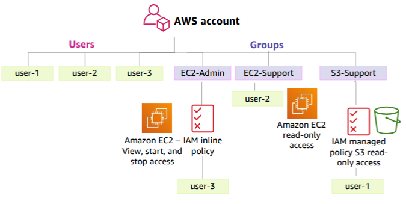

# IAM User & Group Management Lab

This lab focuses on implementing proper Identity and Access Management (IAM) in AWS. The exercise demonstrates how to manage IAM users, groups, and permissions following AWS best practices for security and access control.

## Task Overview

As illustrated in the diagram, this lab implements a solution for managing IAM users, groups, and permissions in an AWS account. The goal is to provide users with specific access to AWS services using IAM groups, inline policies, and managed policies.

### Requirements

The structure is built under one AWS account with the following components:

#### IAM Users
- `user-1`
- `user-2`
- `user-3`

#### IAM Groups
- `EC2-Admin`: Full access to EC2 resources (view, start, stop)
- `EC2-Support`: Read-only access to EC2 resources
- `S3-Support`: Read-only access to S3 resources

#### Policies
- `EC2-Admin`: Has an inline policy for EC2 full access
- `EC2-Support`: Has an AWS managed policy for EC2 read-only access
- `S3-Support`: Has an AWS managed policy for S3 read-only access

## Solution Structure

This lab provides two implementation approaches for the same solution:

### AWS CLI Solution
The `aws_cli` directory contains bash scripts that implement the solution using AWS Command Line Interface (CLI) commands. This approach demonstrates how to:

- Create IAM users
- Create IAM groups
- Create and attach inline policies
- Attach AWS managed policies
- Assign users to appropriate groups

### Terraform Solution
The `terraform` directory contains Infrastructure as Code (IaC) files that implement the same solution using Terraform. This approach demonstrates how to:

- Define and provision IAM users
- Define and provision IAM groups
- Create custom IAM policies
- Reference AWS managed policies
- Assign users to groups

## Learning Objectives

By completing this lab, you will learn:

1. How to implement the principle of least privilege using IAM groups and policies
2. How to distinguish between inline policies and managed policies
3. How to use AWS CLI for IAM management
4. How to use Terraform for IAM resource provisioning
5. Best practices for IAM user and group organization

## Instructions

1. Review the task requirements and diagram
2. Choose your preferred implementation method (AWS CLI or Terraform)
3. Follow the README in the respective directory for detailed steps
4. Validate your implementation by testing user access to various services

## Validation

To validate your implementation:
- Sign in as each user and confirm they have the appropriate access
- Attempt actions that should be allowed and denied based on the policies
- Verify that users cannot access resources outside their permission scope

## Clean-up

Remember to clean up resources after completing the lab to avoid any unwanted charges:
- For AWS CLI: Run the cleanup script in the aws_cli directory
- For Terraform: Run `terraform destroy` in the terraform directory

## Additional Resources

- [AWS IAM Best Practices](https://docs.aws.amazon.com/IAM/latest/UserGuide/best-practices.html)
- [AWS CLI IAM Commands Reference](https://docs.aws.amazon.com/cli/latest/reference/iam/index.html)
- [Terraform AWS Provider IAM Documentation](https://registry.terraform.io/providers/hashicorp/aws/latest/docs/resources/iam_user)
