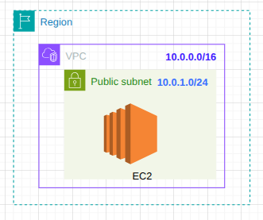
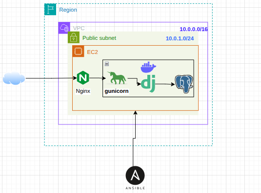

# EC2 Compute Layer Setup Guide

This guide walks through the process of setting up an Amazon EC2 compute layer for hosting a containerized Django application with Nginx as a reverse proxy. The setup includes creating an Amazon ECR repository for storing Docker images and using Ansible for configuration management.

## Architecture Overview





## Provisioning Options

You have two options for provisioning the infrastructure:

### AWS CLI

Use the scripts in the `aws_cli` directory to provision the infrastructure using AWS CLI commands:

```bash
cd aws_cli
chmod +x setup.sh
./setup.sh
```

This will create:
- An EC2 instance with a security group allowing HTTP, HTTPS, and SSH access
- An ECR repository for storing Docker images
- An output file with infrastructure details

### Terraform

Use the Terraform configuration in the `terraform` directory to provision the infrastructure:

```bash
cd terraform
terraform init
terraform apply
```

This will create the same resources as the AWS CLI option but with the added benefits of:
- Infrastructure as Code (IaC)
- Easy reproducibility
- State management
- Automatic output of infrastructure details

Both options will generate the EC2 instance public IP and ECR repository URL for use in subsequent steps.

## Setup Process

### 1. Creating the EC2 Instance

1. **Launch an EC2 Instance**:
   ```bash
   aws ec2 run-instances \
     --image-id ami-xxxxxxxxxxxxxxxxx \
     --instance-type t2.micro \
     --key-name your-key-pair \
     --security-group-ids sg-xxxxxxxxxxxxxxxxx \
     --subnet-id subnet-xxxxxxxxxxxxxxxxx \
     --tag-specifications 'ResourceType=instance,Tags=[{Key=Name,Value=django-web-server}]' \
     --count 1
   ```

2. **Configure Security Group**:
   ```bash
   aws ec2 create-security-group \
     --group-name django-web-sg \
     --description "Security group for Django web server" \
     --vpc-id vpc-xxxxxxxxxxxxxxxxx

   aws ec2 authorize-security-group-ingress \
     --group-id sg-xxxxxxxxxxxxxxxxx \
     --protocol tcp \
     --port 80 \
     --cidr 0.0.0.0/0

   aws ec2 authorize-security-group-ingress \
     --group-id sg-xxxxxxxxxxxxxxxxx \
     --protocol tcp \
     --port 443 \
     --cidr 0.0.0.0/0

   aws ec2 authorize-security-group-ingress \
     --group-id sg-xxxxxxxxxxxxxxxxx \
     --protocol tcp \
     --port 22 \
     --cidr YOUR_IP_ADDRESS/32
   ```

### 2. Creating an Amazon ECR Repository

1. **Create ECR Repository**:
   ```bash
   aws ecr create-repository \
     --repository-name django-web-app \
     --image-scanning-configuration scanOnPush=true \
     --encryption-configuration encryptionType=AES256
   ```

2. **Authenticate Docker to ECR**:
   ```bash
   aws ecr get-login-password --region your-region | docker login --username AWS --password-stdin your-account-id.dkr.ecr.your-region.amazonaws.com
   ```

3. **Build and Push Docker Image**:
   ```bash
   docker build -t django-web-app:latest .
   docker tag django-web-app:latest your-account-id.dkr.ecr.your-region.amazonaws.com/django-web-app:latest
   docker push your-account-id.dkr.ecr.your-region.amazonaws.com/django-web-app:latest
   ```

### 3. Ansible Configuration for Server Setup

Create an Ansible playbook to automate the installation and configuration of:
- Python
- Docker and Docker Compose
- Nginx
- Gunicorn

#### Ansible Directory Structure

```
ansible/
├── inventory.ini
├── playbook.yml
└── roles/
    ├── docker/
    │   └── tasks/
    │       └── main.yml
    ├── nginx/
    │   ├── tasks/
    │   │   └── main.yml
    │   └── templates/
    │       └── django_app.conf.j2
    ├── python/
    │   └── tasks/
    │       └── main.yml
    └── webapp/
        ├── tasks/
        │   └── main.yml
        └── templates/
            └── docker-compose.yml.j2
```

#### Inventory File Example (inventory.ini)

```ini
[webservers]
django-web-server ansible_host=ec2-xx-xx-xx-xx.compute-1.amazonaws.com ansible_user=ec2-user ansible_ssh_private_key_file=~/.ssh/your-key-pair.pem
```

#### Playbook Example (playbook.yml)

```yaml
---
- name: Configure Django Web Server
  hosts: webservers
  become: yes
  roles:
    - python
    - docker
    - nginx
    - webapp
```

#### Role Tasks

**Python Installation (roles/python/tasks/main.yml)**:
```yaml
---
- name: Update apt cache
  apt:
    update_cache: yes
  when: ansible_os_family == "Debian"

- name: Install Python and dependencies
  package:
    name:
      - python3
      - python3-pip
      - python3-dev
      - build-essential
      - libpq-dev
    state: present

- name: Install virtualenv
  pip:
    name: virtualenv
    state: present
```

**Docker Installation (roles/docker/tasks/main.yml)**:
```yaml
---
- name: Install required packages
  package:
    name:
      - apt-transport-https
      - ca-certificates
      - curl
      - software-properties-common
      - gnupg
    state: present
  when: ansible_os_family == "Debian"

- name: Add Docker GPG key
  apt_key:
    url: https://download.docker.com/linux/ubuntu/gpg
    state: present
  when: ansible_os_family == "Debian"

- name: Add Docker repository
  apt_repository:
    repo: deb [arch=amd64] https://download.docker.com/linux/ubuntu {{ ansible_distribution_release }} stable
    state: present
  when: ansible_os_family == "Debian"

- name: Install Docker
  package:
    name:
      - docker-ce
      - docker-ce-cli
      - containerd.io
    state: present

- name: Install Docker Compose
  get_url:
    url: https://github.com/docker/compose/releases/latest/download/docker-compose-{{ ansible_system }}-{{ ansible_architecture }}
    dest: /usr/local/bin/docker-compose
    mode: '0755'

- name: Add user to docker group
  user:
    name: "{{ ansible_user }}"
    groups: docker
    append: yes

- name: Start and enable Docker service
  service:
    name: docker
    state: started
    enabled: yes
```

**Nginx Configuration (roles/nginx/tasks/main.yml)**:
```yaml
---
- name: Install Nginx
  package:
    name: nginx
    state: present

- name: Create Nginx config for Django app
  template:
    src: django_app.conf.j2
    dest: /etc/nginx/sites-available/django_app.conf
  notify: restart nginx

- name: Enable site configuration
  file:
    src: /etc/nginx/sites-available/django_app.conf
    dest: /etc/nginx/sites-enabled/django_app.conf
    state: link
  notify: restart nginx

- name: Remove default Nginx config
  file:
    path: /etc/nginx/sites-enabled/default
    state: absent
  notify: restart nginx

- name: Start and enable Nginx
  service:
    name: nginx
    state: started
    enabled: yes

- name: Configure firewall
  ufw:
    rule: allow
    name: "Nginx Full"
    state: enabled
  when: ansible_os_family == "Debian"
```

**Web Application Deployment (roles/webapp/tasks/main.yml)**:
```yaml
---
- name: Create application directory
  file:
    path: /opt/django-web-app
    state: directory
    mode: '0755'

- name: Create Docker Compose file
  template:
    src: docker-compose.yml.j2
    dest: /opt/django-web-app/docker-compose.yml
    mode: '0644'

- name: Log in to ECR
  shell: aws ecr get-login-password --region {{ aws_region }} | docker login --username AWS --password-stdin {{ aws_account_id }}.dkr.ecr.{{ aws_region }}.amazonaws.com
  environment:
    AWS_ACCESS_KEY_ID: "{{ aws_access_key }}"
    AWS_SECRET_ACCESS_KEY: "{{ aws_secret_key }}"

- name: Pull latest Docker image
  docker_image:
    name: "{{ aws_account_id }}.dkr.ecr.{{ aws_region }}.amazonaws.com/django-web-app:latest"
    source: pull

- name: Deploy with Docker Compose
  docker_compose:
    project_src: /opt/django-web-app
    state: present
```

#### Nginx Configuration Template (roles/nginx/templates/django_app.conf.j2)

```nginx
server {
    listen 80;
    server_name {{ server_domain_name }};

    location /static/ {
        alias /opt/django-web-app/static/;
    }

    location /media/ {
        alias /opt/django-web-app/media/;
    }

    location / {
        proxy_pass http://127.0.0.1:8000;
        proxy_set_header Host $host;
        proxy_set_header X-Real-IP $remote_addr;
        proxy_set_header X-Forwarded-For $proxy_add_x_forwarded_for;
        proxy_set_header X-Forwarded-Proto $scheme;
    }
}
```

#### Docker Compose Template (roles/webapp/templates/docker-compose.yml.j2)

```yaml
version: '3'

services:
  db:
    image: postgres:13
    volumes:
      - postgres_data:/var/lib/postgresql/data/
    env_file:
      - ./.env
    environment:
      - POSTGRES_PASSWORD={{ db_password }}
      - POSTGRES_USER={{ db_user }}
      - POSTGRES_DB={{ db_name }}
    restart: unless-stopped

  web:
    image: {{ aws_account_id }}.dkr.ecr.{{ aws_region }}.amazonaws.com/django-web-app:latest
    restart: unless-stopped
    depends_on:
      - db
    env_file:
      - ./.env
    environment:
      - DATABASE_URL=postgres://{{ db_user }}:{{ db_password }}@db:5432/{{ db_name }}
      - DEBUG=0
    volumes:
      - static_volume:/app/static
      - media_volume:/app/media
    command: gunicorn myproject.wsgi:application --bind 0.0.0.0:8000

volumes:
  postgres_data:
  static_volume:
  media_volume:
```

### 4. Running the Ansible Playbook

```bash
ansible-playbook -i ansible/inventory.ini ansible/playbook.yml
```

## Troubleshooting

### Common Issues and Solutions

1. **Docker Permissions Issue**:
   ```bash
   sudo usermod -aG docker $USER
   newgrp docker
   ```

2. **Nginx and Docker Network Issue**:
   - Make sure Docker container exposes the correct port
   - Check Nginx configuration points to the correct port

3. **ECR Authentication Errors**:
   - Ensure your AWS credentials are valid
   - Re-run authentication command if token has expired

### Logs to Check

- Nginx logs: `/var/log/nginx/error.log` and `/var/log/nginx/access.log`
- Docker container logs: `docker logs <container_id>`
- Application logs: Inside the Django application container

## Next Steps

After successful deployment:

1. **Set up SSL/TLS with Let's Encrypt**
2. **Configure auto-scaling with AWS Auto Scaling Groups**
3. **Implement a CI/CD pipeline with AWS CodePipeline**
4. **Set up monitoring with CloudWatch**

## Additional Resources

- [AWS EC2 Documentation](https://docs.aws.amazon.com/AWSEC2/latest/UserGuide/concepts.html)
- [Amazon ECR User Guide](https://docs.aws.amazon.com/AmazonECR/latest/userguide/what-is-ecr.html)
- [Ansible Documentation](https://docs.ansible.com/)
- [Docker Documentation](https://docs.docker.com/)
- [Nginx Documentation](https://nginx.org/en/docs/)
- [Gunicorn Documentation](https://docs.gunicorn.org/)
