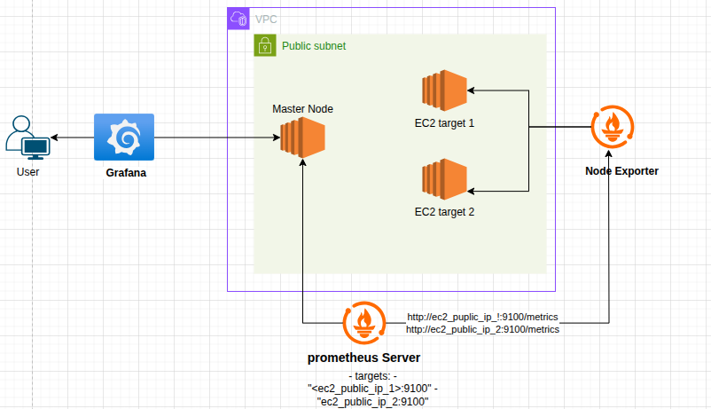

# Prometheus & Grafana Monitoring Stack

This project sets up a comprehensive monitoring solution using Prometheus and Grafana on AWS EC2 instances. The infrastructure is provisioned using Terraform and configured using Ansible playbooks.

## 🏗️ Architecture Overview



The monitoring stack consists of:

- **1 Master Node**: Running Prometheus Server and Grafana
- **2 Target Nodes**: Running Node Exporter for metrics collection
- **VPC**: Secure network environment with public subnet
- **User Access**: External access to Grafana dashboard

### Data Flow
1. **Node Exporters** on EC2 target instances collect system metrics
2. **Prometheus Server** scrapes metrics from Node Exporters every 15 seconds
3. **Grafana** queries Prometheus for data visualization
4. **Users** access monitoring dashboards through Grafana web interface

## 📋 Components

### Prometheus Server
- **Purpose**: Metrics collection, storage, and alerting
- **Port**: 9090
- **Targets**: 
  - Self-monitoring (localhost:9090)
  - Node Exporter instances (EC2_IP:9100)

### Grafana
- **Purpose**: Data visualization and dashboards
- **Port**: 3000
- **Features**: Pre-configured Prometheus datasource

### Node Exporter
- **Purpose**: System metrics collection
- **Port**: 9100
- **Metrics**: CPU, Memory, Disk, Network, System load

## 🚀 Infrastructure as Code (Terraform)

### Terraform Overview
Terraform is used to provision the AWS infrastructure in a declarative manner. The infrastructure includes:

#### Resources Managed:
- **VPC & Networking**: Virtual Private Cloud with public subnets
- **Security Groups**: Firewall rules for Prometheus (9090), Grafana (3000), Node Exporter (9100)
- **EC2 Instances**: 
  - 1x Master instance (Prometheus + Grafana)
  - 2x Target instances (Node Exporter)
- **Key Pairs**: SSH access configuration
- **Elastic IPs**: Static IP addresses for instances

#### Benefits:
- **Reproducible**: Infrastructure can be recreated consistently
- **Version Controlled**: Infrastructure changes are tracked
- **Scalable**: Easy to add more monitoring targets
- **Cost Effective**: Resources can be destroyed when not needed

### Terraform Structure
```
├── main.tf           # Main infrastructure 
├── outputs.tf        # Output values (IPs)

```
## ⚙️ Configuration Management (Ansible)

### Ansible Overview
Ansible automates the configuration and deployment of monitoring components across the EC2 instances. It uses agentless architecture with SSH connections.

#### Key Features:
- **Idempotent**: Safe to run multiple times
- **Declarative**: Define desired state, not steps
- **Modular**: Separate playbooks for different components
- **Secure**: Proper user management and permissions

### Ansible Playbooks

#### 1. `prometheus.yml`
**Purpose**: Installs and configures Prometheus server
- Downloads Prometheus binary (v2.53.2)
- Creates dedicated system user (`prometheus`)
- Configures scrape targets
- Sets up systemd service
- Configures proper file permissions

#### 2. `grafana.yml`
**Purpose**: Installs and configures Grafana
- Adds official Grafana repository
- Installs Grafana package
- Configures basic settings (port, admin credentials)
- Starts and enables service
- Opens firewall ports

#### 3. `node_exporter.yml`
**Purpose**: Installs Node Exporter on target instances
- Downloads Node Exporter binary
- Creates dedicated system user
- Configures systemd service
- Sets up metric collection
- Enables firewall access
#### 4. `webserver.yml`
**Purpose**: Installs a simple web server (e.g., Nginx) on the targets nodes for testing


## 🛠️ Setup Instructions

### Prerequisites
- AWS Account with appropriate permissions
- Terraform installed (>= 1.0)
- Ansible installed (>= 2.9)
- AWS CLI configured
- SSH key pair for EC2 access

### Step 1: Infrastructure Deployment
```bash
# Navigate to terraform directory
cd terraform/

# Initialize Terraform
terraform init

# Review planned changes
terraform plan

# Deploy infrastructure
terraform apply

# Output the public IPs of the instances
terraform output
```

### Step 2: Configure Monitoring Stack
```bash
# change the IPs addresses in `inventory.ini` to match your EC2 instances 

# setup and install prometheus
ansible-playbook -i inventory.ini prometheus.yml

# setup Grafana
ansible-playbook -i inventory.ini grafana.yml

# setup Node Exporter on target instances
ansible-playbook -i inventory.ini node_exporter.yml
```

### Step 3: Access Monitoring
1. **Prometheus**: `http://<master-node-ip>:9090`
2. **Grafana**: `http://<master-node-ip>:3000`
   - Username: `admin`
   - Password: `admin` (change after first login)

## 📊 Monitoring Targets

The Prometheus configuration monitors:

### System Metrics (Node Exporter)
- **CPU Usage**: Utilization across cores
- **Memory**: Available, used, cached memory
- **Disk Space**: Usage and available space
- **Network**: Traffic, errors, packets
- **System Load**: 1, 5, 15-minute averages
- **File Systems**: Mount points and usage

### Prometheus Self-Monitoring
- **TSDB Metrics**: Time series database statistics
- **Query Performance**: Query execution times
- **Resource Usage**: Prometheus server resources

## 🔧 Configuration Files

### Prometheus Configuration (`prometheus.yml`)
```yaml
global:
  scrape_interval: 15s

scrape_configs:
  - job_name: "prometheus"
    static_configs:
      - targets: ["localhost:9090"]
      
  - job_name: "node_exporter"
    static_configs:
      - targets:
          - "35.175.253.80:9100"  # EC2 Target 1
          - "54.89.93.188:9100"   # EC2 Target 2
```

## 🧪 Load Testing

This section explains how to perform load testing on your target EC2 instances to validate your monitoring setup and observe system behavior under stress.

### Prerequisites for Load Testing

First, install the `stress` utility on your target EC2 instances:

```bash
# Connect to your target instances
ssh -i your-key.pem ec2-user@<target-instance-ip>

# Install stress utility (Amazon Linux/RHEL/CentOS)
sudo yum update -y
sudo yum install -y stress

# For Ubuntu/Debian instances
sudo apt update
sudo apt install -y stress
```

### Load Testing Scenarios

#### 1. CPU Stress Testing

**High CPU Load Test:**
```bash
# Generate load on all CPU cores for 5 minutes
stress --cpu $(nproc) --timeout 300s

# Generate load on 2 CPU cores for 2 minutes
stress --cpu 2 --timeout 120s

# Generate moderate load (50% CPU usage)
stress --cpu 1 --timeout 300s &
```

**Monitor in Grafana:**
- Watch CPU utilization graphs spike to 100%
- Observe load averages (1m, 5m, 15m) increase
- Check CPU wait time and context switches

#### 2. Memory Stress Testing

**Memory Allocation Test:**
```bash
# Allocate 1GB of memory for 3 minutes
stress --vm 1 --vm-bytes 1G --timeout 180s

# Allocate 80% of available memory
TOTAL_MEM=$(free -m | awk 'NR==2{printf "%.0f", $2*0.8}')
stress --vm 1 --vm-bytes ${TOTAL_MEM}M --timeout 300s

# Multiple memory workers
stress --vm 4 --vm-bytes 512M --timeout 240s
```

**Monitor in Grafana:**
- Watch memory usage increase dramatically
- Observe available memory decrease
- Check swap usage if memory is exhausted

#### 3. Disk I/O Stress Testing

**Disk Write Test:**
```bash
# Generate disk I/O load
stress --io 4 --timeout 300s

# Combined disk and CPU stress
stress --io 2 --cpu 2 --timeout 180s

# Create large temporary files
stress --hdd 2 --hdd-bytes 1G --timeout 240s
```

**Monitor in Grafana:**
- Watch disk I/O rates increase
- Observe disk utilization percentage
- Check disk read/write latency

#### 4. Network Stress Testing

**Network Load Test using iperf3:**
```bash
# Install iperf3 first
sudo yum install -y iperf3  # Amazon Linux/RHEL/CentOS
# OR
sudo apt install -y iperf3  # Ubuntu/Debian

# On target instance 1 (server mode)
iperf3 -s -p 5001

# On target instance 2 (client mode)
iperf3 -c <target-instance-1-ip> -p 5001 -t 300
```

**Monitor in Grafana:**
- Watch network bytes in/out increase
- Observe network packet rates
- Check network errors and drops

#### 5. Combined Stress Testing

**Full System Stress:**
```bash
# Stress all system components simultaneously
stress --cpu 2 --vm 1 --vm-bytes 512M --io 1 --hdd 1 --hdd-bytes 256M --timeout 300s

# Moderate combined load for extended period
stress --cpu 1 --vm 1 --vm-bytes 256M --io 1 --timeout 600s
```

### Load Testing Best Practices

1. **Start Small**: Begin with light loads and gradually increase
2. **Monitor Continuously**: Keep Grafana dashboards open during tests
3. **Document Baselines**: Record normal system performance metrics
4. **Test Incrementally**: Test individual components before combined loads
5. **Plan Recovery**: Know how to stop stress tests if systems become unresponsive
6. **Alert Thresholds**: Set up alerts before running intensive tests

### Stopping Load Tests

```bash
# Stop all stress processes
sudo pkill stress

# Or use specific process IDs
ps aux | grep stress
sudo kill <process-id>

# Monitor system recovery
watch -n 1 'uptime && free -h'
```


