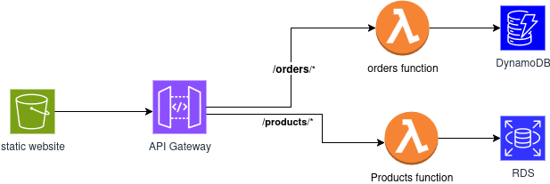

# Serverless E-Commerce Application

This project implements a serverless e-commerce application using AWS services. The architecture follows a microservices pattern with separate services for products and orders.

## Architecture



The application consists of the following components:

- **Static Website**: Hosted on Amazon S3
- **API Gateway**: Routes requests to appropriate Lambda functions
- **Lambda Functions**: Run containerized FastAPI applications
- **Databases**: RDS MySQL for products and DynamoDB for orders

## Project Structure

```
api_gateway/
├── products/                # Products microservice
│   ├── app/                 # FastAPI application code
│   ├── tests/               # Unit tests
│   ├── Dockerfile           # Docker configuration
│   └── requirements.txt     # Python dependencies
├── orders/                  # Orders microservice
│   ├── app/                 # FastAPI application code
│   ├── tests/               # Unit tests
│   ├── Dockerfile           # Docker configuration
│   └── requirements.txt     # Python dependencies
├── terraform/               # Infrastructure as Code
│   ├── main.tf              # Main Terraform configuration
│   ├── variables.tf         # Input variables
│   ├── outputs.tf           # Output values
│   ├── terraform.tfvars.example  # Example variable values
│   └── modules/             # Terraform modules
│       ├── s3/              # S3 website hosting
│       ├── api_gateway/     # API Gateway configuration
│       ├── lambda/          # Lambda functions
│       ├── rds/             # RDS database
│       ├── dynamodb/        # DynamoDB tables
│       ├── vpc/             # VPC networking
│       └── ecr/             # ECR repositories
└── website/                 # Static website files
    ├── css/                 # Stylesheets
    ├── js/                  # JavaScript files
    └── images/              # Image assets
```

## Prerequisites

- AWS CLI configured with appropriate permissions
- Terraform installed (v1.0.0+)
- Docker installed
- Python 3.11+

## Deployment Instructions

### 1. Configure Terraform Variables

Copy the example variables file and update it with your values:

```bash
cd terraform
cp terraform.tfvars.example terraform.tfvars
```

Edit `terraform.tfvars` with your preferred text editor and update the values.

### 2. Build Docker Images for Lambda Functions

Build and push the Docker images for the Products and Orders services:

```bash
# Build Products service image
cd ../products
docker build -t products-service .

# Build Orders service image
cd ../orders
docker build -t orders-service .

# After creating ECR repositories with Terraform, push images
# (Commands will be available in Terraform outputs)
```

### 3. Deploy Infrastructure with Terraform

Initialize and apply the Terraform configuration:

```bash
cd ../terraform
terraform init
terraform apply
```

Review the changes and type `yes` to proceed with the deployment.

### 4. Update Frontend Configuration

After deployment, update the API Gateway URL in the frontend configuration:

1. Get the API Gateway URL from Terraform outputs
2. Update `website/js/config.js` with the correct URL
3. Upload the website files to the S3 bucket

```bash
# Example command to upload website files
aws s3 sync ../website/ s3://your-bucket-name/ --acl public-read
```

## API Endpoints

### Products API

- `GET /products`: List all products
- `POST /products`: Create a new product
- `GET /products/{product_id}`: Get a single product
- `PUT /products/{product_id}`: Update a product
- `DELETE /products/{product_id}`: Delete a product

### Orders API

- `POST /orders`: Create a new order
- `GET /orders/{order_id}?customer_id={customer_id}`: Get a specific order
- `GET /customers/{customer_id}/orders`: Get all orders for a customer
- `PUT /orders/{order_id}`: Update an order's status

## Testing

To test the deployment:

1. Open the website URL (available in Terraform outputs)
2. Browse products and add them to your cart
3. Proceed to checkout and place an order
4. View your orders using your customer ID

## Cleanup

To remove all resources created by this project:

```bash
cd terraform
terraform destroy
```

Review the changes and type `yes` to proceed with the deletion.

## Security Considerations

- The database credentials are stored in Terraform variables. In a production environment, consider using AWS Secrets Manager.
- The S3 bucket is configured for public access to host the website. Ensure only necessary files are uploaded.
- API Gateway does not implement authentication in this example. For production, consider adding authentication mechanisms.

## License

This project is licensed under the MIT License - see the LICENSE file for details.
